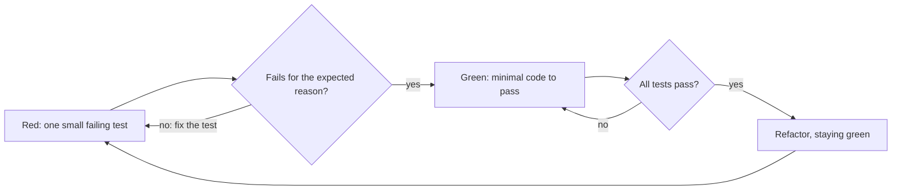

# 2. Develop with Test-Driven Development

## Context

We want a fast feedback loop, a regression safety net, executable documentation of
behavior, and the freedom to refactor without fear. Tests written after the fact tend to
pass immediately, verify the implementation rather than the requirement, and miss the edge
cases the author already forgot — so they prove little.

## Decision

We practice **Test-Driven Development** for features, bug fixes, and behavior changes,
following the red → green → refactor cycle:

1. **Red** — write one small failing test describing the desired behavior, and *watch it
   fail for the expected reason* before writing any production code.
2. **Green** — write the minimal code to make it pass.
3. **Refactor** — clean up while staying green.

The iron law: **no production code without a failing test first.** A bug fix starts with a
test that reproduces the bug. Exploratory spikes are thrown away and rebuilt test-first.

The cycle, with the step that is easiest to skip drawn as a gate:

## Alternatives considered

- **Test-after development** — tests written once the code works tend to pass immediately
  and verify the implementation rather than the requirement, proving little.
- **Manual QA only, no automated suite** — cheap in the moment but expensive on every
  regression, with no safety net for refactoring.
- **Coverage-driven testing (write tests to hit a percentage, not to drive design)** —
  produces tests after the fact aimed at a metric, missing the design pressure TDD
  provides.

## Consequences

- Every behavior has a test that was proven to fail without the code, so the suite has
  real diagnostic power.
- Design pressure surfaces early: code that is hard to test is hard to use, and we hear
  that signal before the design sets.
- The discipline has a learning curve and feels slower on trivial code, a cost we accept
  for the confidence and refactorability it buys.
