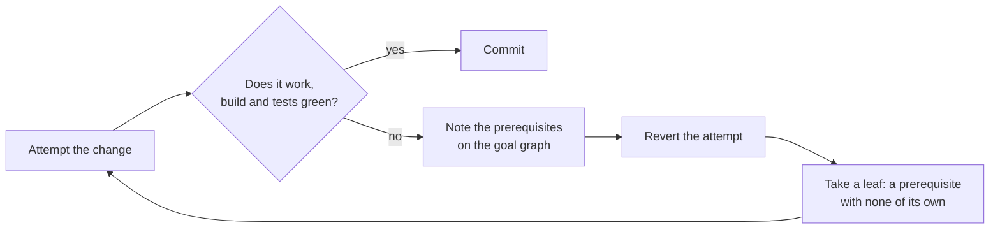
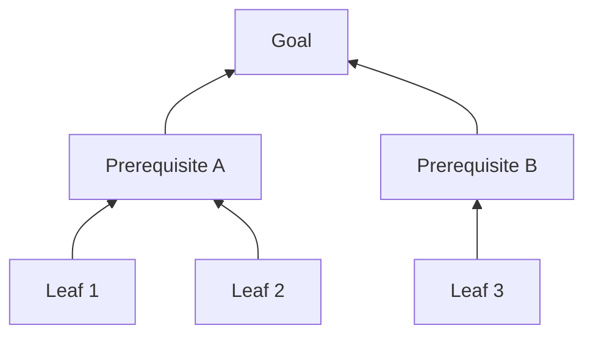

# 4. Use the Mikado Method to keep the build green

## Context

Large refactorings, and changes that ripple across a codebase, tempt us into long stretches
where nothing compiles and nothing is committable. That is where work stalls, conflicts
pile up, and mistakes hide. We want the build green at every step, even mid-migration.

## Decision

We use the **Mikado Method** for refactoring, bug fixes, and new work wherever it is
feasible:

- Attempt the change directly. When it reveals prerequisites, note them as a goal graph,
  revert, and complete the prerequisites first — leaves before the trunk.
- Keep every committed step **green**: the build passes and tests pass after each one.
- For type or interface migrations, prefer **parallel-change** (introduce the new form
  alongside the old, migrate call sites incrementally, then remove the old) rather than a
  single breaking edit.

The loop. Each failed attempt buys knowledge, and the revert is what keeps the tree green:

The graph that builds up, worked leaves first so every commit is green:

## Alternatives considered

- **Big-bang refactor on a long-lived branch** — nothing is committable until the whole
  change compiles, which is exactly the stalled, conflict-prone state this ADR avoids.
- **Stop-and-fix each prerequisite before attempting the change** — loses the goal-graph
  visibility that Mikado's attempt-then-revert step surfaces up front.
- **A single breaking edit behind a feature flag** — still forces an all-or-nothing cutover
  at flag-removal time instead of the incremental, parallel-change migration we prefer.

## Consequences

- The build is never left broken across commits; work is always in an integrable state.
- Big changes arrive as a sequence of small, reviewable, reversible steps.
- There is some overhead in mapping prerequisites and maintaining parallel forms during a
  migration, which we accept in exchange for never being stuck.
